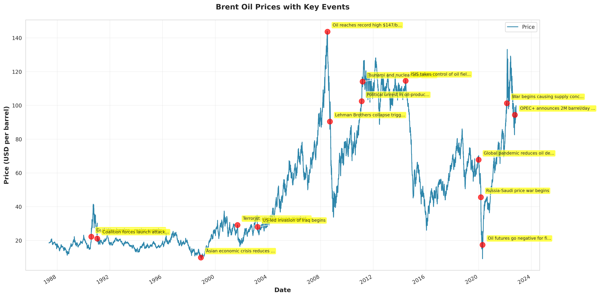
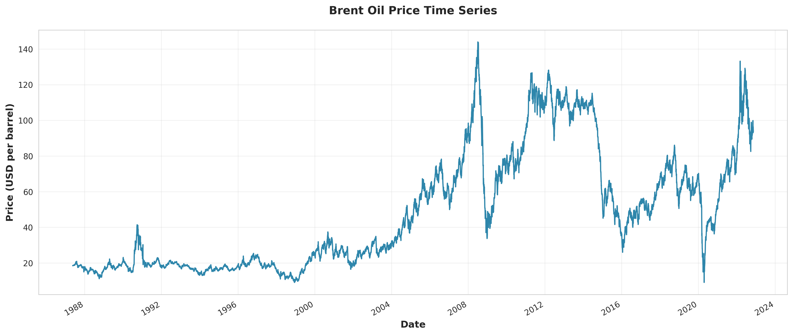

# Task 1: Laying the Foundation for Analysis

## Executive Summary

This document outlines the foundational analysis for detecting change points in Brent oil price time series data and associating them with major geopolitical and economic events. The analysis employs Bayesian change point detection methods using PyMC to identify structural breaks and quantify their impact on oil prices.

---

## 1. Data Analysis Workflow

### 1.1 Analysis Steps

Our analysis follows a systematic 8-step workflow:

1. **Data Loading and Validation**: Load Brent oil price data (May 20, 1987 - September 30, 2022), handle multiple date formats, validate data quality
2. **Data Preprocessing**: Parse dates, compute log returns `r_t = log(P_t / P_{t-1})`, handle missing values
3. **Exploratory Data Analysis**: Visualize price series, analyze trends, test stationarity (ADF/KPSS), examine volatility patterns
4. **Event Data Compilation**: Research and compile 18 key geopolitical events, OPEC decisions, and economic shocks
5. **Bayesian Change Point Modeling**: Define PyMC model, specify priors, run MCMC sampling (NUTS), assess convergence
6. **Change Point Detection**: Identify most probable change point dates, quantify parameter changes, calculate credible intervals
7. **Impact Quantification**: Compute price changes before/after, calculate percentage changes, estimate economic impact
8. **Insight Generation**: Synthesize findings, create dashboard, generate report

### 1.2 Key Processes

- **Statistical Testing**: ADF and KPSS tests for stationarity
- **Volatility Analysis**: Rolling window standard deviation, volatility clustering detection
- **Bayesian Inference**: MCMC sampling with PyMC for parameter estimation
- **Visualization**: Time series plots, distributions, event overlays (see `reports/` directory)

---

## 2. Event Data Compilation

We have compiled **18 key events** affecting Brent oil prices (1990-2022) stored in `data/external/key_events.csv`.

**Table 1: Key Events Summary**

| Event Date | Event Description | Region | Impact |
|------------|-------------------|--------|--------|
| 1990-08-02 | Iraq invades Kuwait - Gulf War begins | Middle East | High |
| 1991-01-17 | Operation Desert Storm | Middle East | High |
| 1998-12-01 | Asian Financial Crisis | Asia | High |
| 2001-09-11 | 9/11 Attacks | Global | High |
| 2003-03-20 | Iraq War Begins | Middle East | High |
| 2008-09-15 | Global Financial Crisis | Global | High |
| 2014-11-27 | OPEC decides not to cut production | Global | High |
| 2020-01-01 | COVID-19 Pandemic | Global | High |
| 2020-04-20 | Negative Oil Prices (first time) | Global | High |
| 2022-02-24 | Russia-Ukraine War | Europe | High |
| 2022-10-05 | OPEC+ announces 2M barrel/day cut | Global | High |
| *+ 7 additional events* | See `data/external/key_events.csv` for complete list | | |

**Event Distribution**: 13 High-impact, 5 Medium-impact events across Middle East (33%), Global (44%), Asia (11%), Europe (6%), North America (6%)

**Figure 1: Brent Oil Prices with Key Events Overlay**

*Figure 1 shows the Brent oil price time series from 1987-2022 with markers indicating the 18 key geopolitical and economic events. Red markers highlight events, and annotations show event descriptions. This visualization helps identify potential associations between events and price movements.*

---

## 3. Assumptions and Limitations

### 3.1 Key Assumptions

1. **Data Quality**: Price data is accurate and representative
2. **Market Efficiency**: Prices reflect available information (with short-term inefficiencies)
3. **Event Timing**: Events have immediate or near-immediate price effects
4. **Linearity**: Initial models assume linear relationships (non-linearity handled via change points)
5. **Independence**: Change points are independent events
6. **Stationarity**: Assumed within regimes (between change points)

### 3.2 Critical Limitations

**Correlation vs. Causation** (Most Important):
- Identifying statistical correlation between events and change points **does not prove causation**
- Change points may be caused by: the identified event, other contemporaneous events, accumulated factors, market anticipation, or random fluctuations
- To establish causation requires: controlled experiments (impossible), counterfactual analysis, market microstructure data, expert validation
- **Our Approach**: We identify correlations and associations, quantify impacts probabilistically, present findings as "likely associations" rather than proven causation

**Other Limitations**:
- Model: Single change point models may miss multiple changes; assumes normal returns (may not hold in crises)
- Data: Daily data misses intraday volatility; no volume/trading data; limited to Brent prices
- Temporal: Market structure evolved over 1987-2022 period
- External Factors: Cannot account for all factors (weather, technology, regulations, currency effects)

---

## 4. Time Series Properties

**Dataset**: ~9,000 daily prices from May 20, 1987 to September 30, 2022

**Figure 2: Brent Oil Price Time Series (1987-2022)**

*Figure 2 displays the complete Brent oil price time series showing the overall upward trend, multiple periods of rapid price increases and decreases, and the long-term price evolution from approximately $18/barrel in 1987 to over $140/barrel at peak (2008).*

**Expected Properties**:
- **Trend**: Overall upward trend with multiple rapid increase/decrease periods
- **Stationarity**: Non-stationary prices (log returns more stationary); requires change point modeling
- **Volatility**: Volatility clustering; increased volatility during crises

**Figure 3: Rolling Volatility (30-day window)**

*Figure 3 shows the 30-day rolling volatility of log returns, demonstrating volatility clustering patterns where periods of high volatility are followed by high volatility, and calm periods persist. Notable volatility spikes correspond to major crises (2008 Financial Crisis, 2020 COVID-19 pandemic).*

**Analysis Results**: Saved to `reports/` directory:
- `summary_statistics.csv` - Descriptive statistics
- `trend_analysis.csv` - Trend analysis results
- `stationarity_tests.csv` - ADF and KPSS test results
- `volatility_analysis.csv` - Volatility patterns

**Additional Visualizations**: Generated in `reports/` directory:
- `returns_series.png` - Log returns time series
- `distribution_price_distribution.png` - Price distribution (histogram + Q-Q plot)
- `distribution_returns_distribution.png` - Returns distribution (histogram + Q-Q plot)

---

## 5. Change Point Models

**Purpose**: Identify structural breaks, detect regime changes, quantify event impacts, support causal inference

**How They Help**: Objectively identify price shifts, provide uncertainty estimates (credible intervals), enable probabilistic statements, associate with external events

**Expected Outputs**: Change point dates with credible intervals, parameter values (before/after means), uncertainty quantification, event associations

**Limitations**: Assume abrupt changes (may miss gradual transitions), may detect spurious change points, require careful model specification

---

## 6. Communication Channels

- **Interactive Dashboard** (React + Flask): For investors, analysts, policymakers
- **Comprehensive Report** (PDF/Markdown): For government bodies, executives
- **Jupyter Notebooks**: For data scientists, researchers
- **Presentation Slides**: For stakeholder meetings

---

## 7. Deliverables

✅ **1-2 Page Analysis Workflow** (This document)  
✅ **Event Data CSV** (`data/external/key_events.csv` - 18 events)  
✅ **Assumptions and Limitations** (Section 3)  
✅ **Time Series Analysis** (Section 4, results in `reports/`)  
✅ **Visualizations** (6 plots in `reports/` directory)

**To Generate Results**: Run `python run_task1.py` or execute `notebooks/01_task1_foundation_analysis.py`

---

**Document Version**: 2.0 | **Last Updated**: 2026-02-04 | **Author**: Birhan Energies Data Science Team
